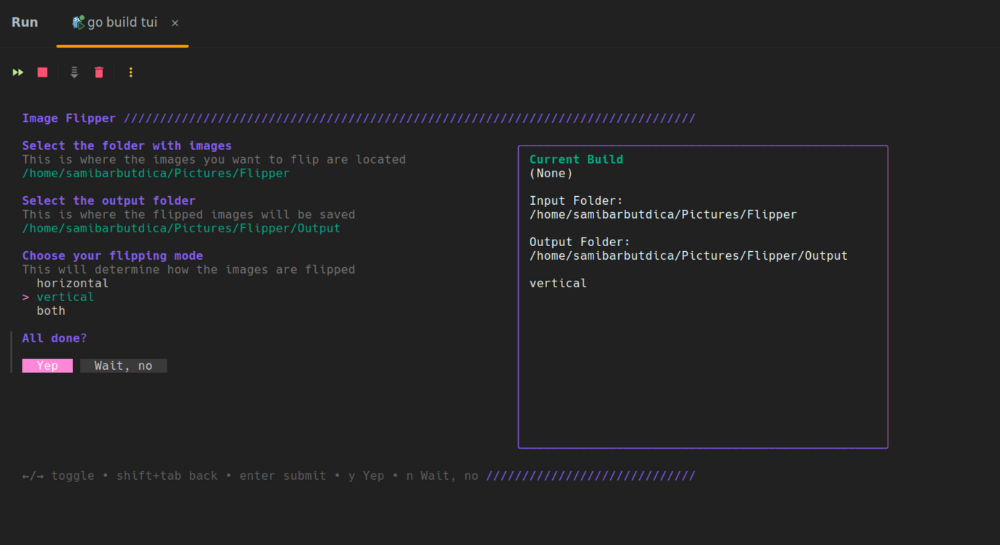
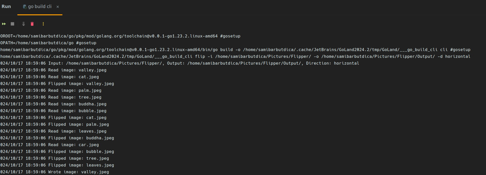

# image-flipper

Image flipper implemented as a Flutter GUI and a Go TUI with support for:
- horizontal, vertical and horizontal-vertical (both) flipping

### Input images folder

### Output images folder (after flipping)

## GUI

Implemented using Flutter Cubit (BLoC related state management package)

## TUI

Implemented using Golang Bubbletea (framework for building TUI apps), Huh forms, errgroups and pipeline pattern for image processing.

## CLI

Implemented using Golang Cobra (framework for building CLI apps), errgroups and pipeline pattern for image processing.

