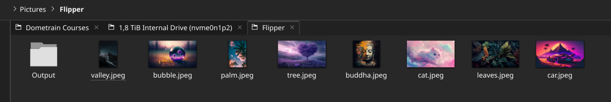
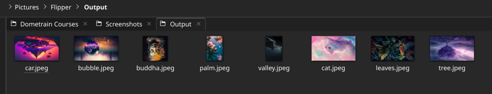
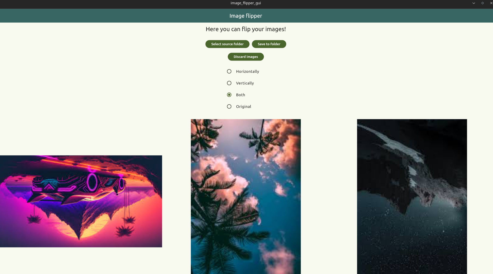

# image-flipper

Image flipper implemented as a Flutter GUI and a Go TUI with support for:
- horizontal, vertical and horizontal-vertical (both) flipping

### Input images folder

### Output images folder (after flipping)

## GUI

## TUI
